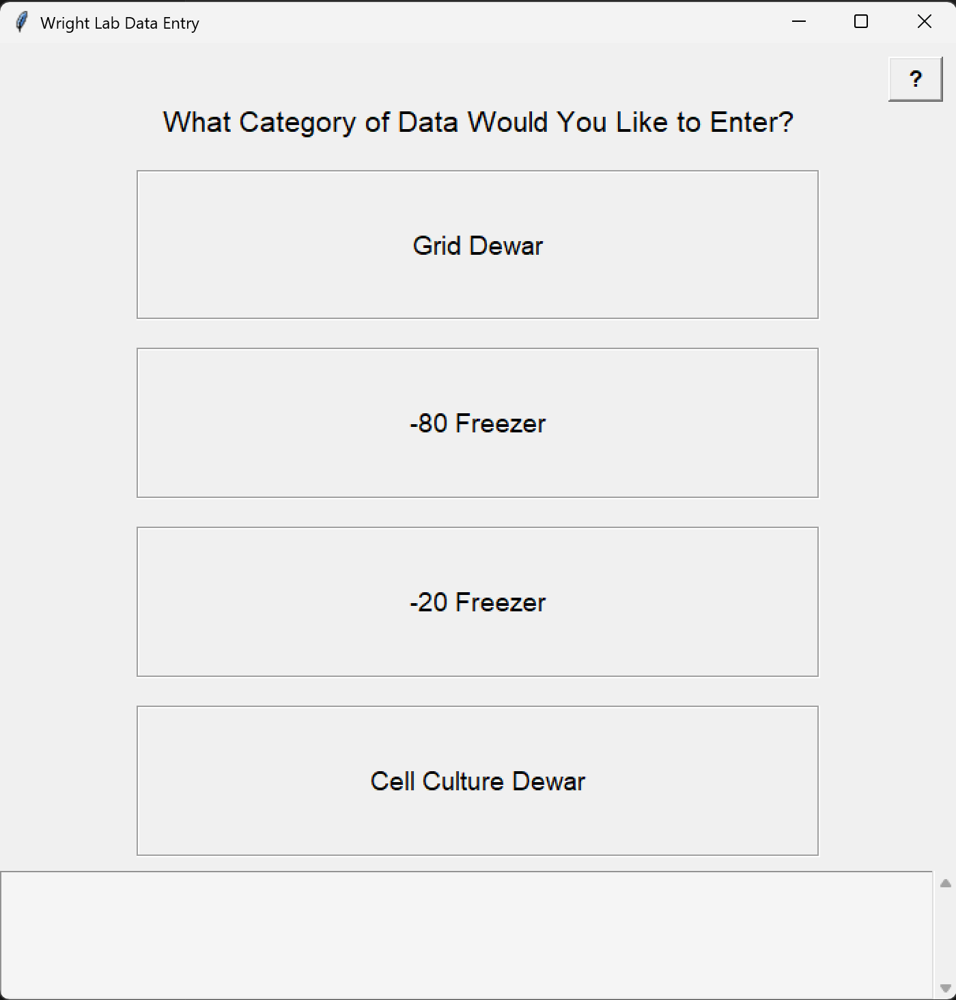

# Wright_Lab_Inventory_Tools

Author: Joe Baumgardt, Copyright 2025

Python project for connecting inventories and updating.

These python scripts integrate with Google Drive sheets (.xlsx) via a Google Drive API.

## Installation and Setup Notes

This was initially written with Python 3.10.

### Create a virtual environment and install dependencies

`python3.10 -m venv venv`
`source venv/bin/activate`
`python3 -m pip install -r requirements.txt`

Before you can use these scripts, you will need to generate a 'credentials.json' from your Google Drive user, and then derive a 'tokens.json' that allows the Python scripts to connect long-term.

## Licensing info
To be added.
